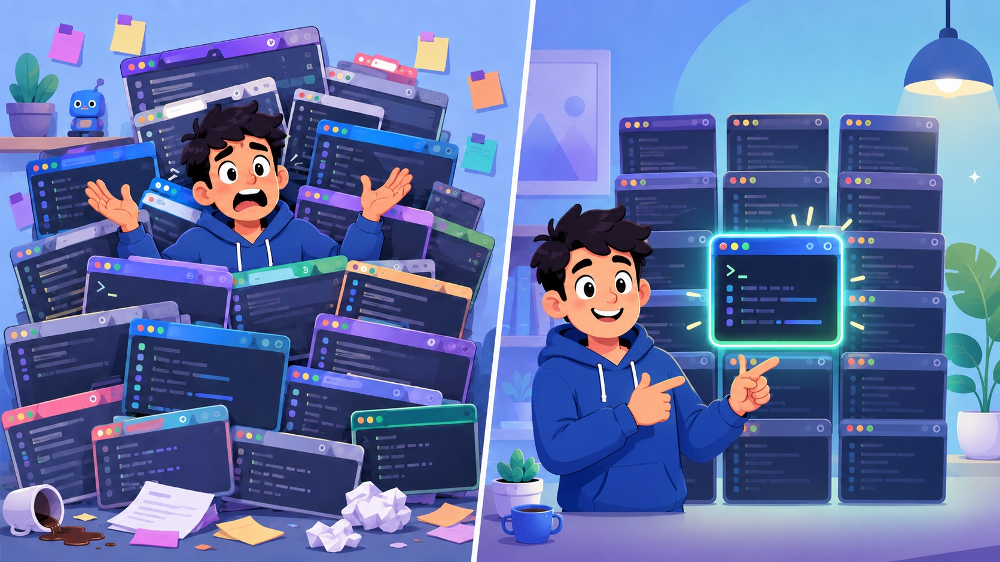

# iterm2_ruby

[](https://rubygems.org/gems/iterm2_ruby)
[](https://github.com/fkchang/iterm2_ruby/actions/workflows/ci.yml)
[](https://opensource.org/licenses/MIT)



Ruby gem + CLI for controlling iTerm2 via its native WebSocket + Protobuf API.

**Too many iTerms. Too many tabs. Too many agents "helping" you at once.**

GenAI made you think you can do 20 things at once. It was wrong, but you did it anyway and you're still doing it, and now you've got 20 terminal windows and no idea which one's stuck waiting on you. `osascript` is too slow to keep up, steals your focus every time it tries, and nags you for an Automation permission it already has. iterm2_ruby skips all of that: it talks to iTerm2 directly, so you can actually navigate the mess you made -- ~20x faster, no focus theft, plus real-time event notifications so you don't have to go looking in the first place.

## Real-World Usage

Four things it's doing today, in real projects:

**Jump to any running session instantly, by project name.** No window-hunting:

```ruby
ITerm2.connect { |c| c.raise_by_title(project_name) }
```

No stolen focus, no AppleScript delay -- just the right window, front and center.

**A live dashboard across every open terminal.** One call returns every window, tab, and session, enriched with project name, status, cwd, and PID:

```ruby
data = ITerm2.connect { |c| c.topology_for_aggregator }
```

This feeds a real-time "mission control" view over a whole fleet of sessions.

**Split a pane and pop a live browser preview next to your code:**

```ruby
ITerm2.connect do |c|
  c.split_pane(guid, vertical: true, profile_name: "Web Browser",
               profile_customizations: { "Initial URL" => url })
end
```

**Spawn a background task in its own window, no permission dialogs:**

```bash
iterm2ctl create window          # => session E8F2...
iterm2ctl send "run-task.sh" --session E8F2...
```

AppleScript automation triggers a macOS Automation prompt every time. This doesn't.

## Installation

```bash
gem install iterm2_ruby
```

Or add to your Gemfile:

```ruby
gem "iterm2_ruby"
```

## Prerequisites

- **macOS** with [iTerm2](https://iterm2.com/) installed
- **Ruby >= 3.1**
- iTerm2 API enabled: Preferences > General > Magic > Enable Python API

## Quick Start (CLI)

```bash
# List all windows/tabs/sessions
iterm2ctl list

# Send text to the active session
iterm2ctl send "echo hello"

# Read visible screen contents
iterm2ctl read

# Raise tab matching a title pattern
iterm2ctl raise "my-project"

# Show current focus state
iterm2ctl focus

# Watch for events in real-time
iterm2ctl watch
```

## Quick Start (Ruby API)

### One-shot (auto-connects, runs command, disconnects)

```ruby
require "iterm2"

# List all sessions
sessions = ITerm2.topology
sessions.each { |s| puts "#{s[:session_id]} - #{s[:title]}" }

# Send text to a session
ITerm2.send_text(session_id, "ls -la\n")

# Read screen contents
screen = ITerm2.read_screen(session_id)
puts screen[:lines].join("\n")

# Raise a tab by title
ITerm2.raise_by_title("my-project")

# Get current focus
focus = ITerm2.focus
puts focus[:active_session]
```

### Persistent client (reuses connection)

```ruby
require "iterm2"

ITerm2.connect do |client|
  # List sessions
  sessions = client.topology
  session_id = sessions.first[:session_id]

  # Get detailed session info
  info = client.session_info(session_id)
  puts "CWD: #{info[:cwd]}, PID: #{info[:pid]}"

  # Watch for focus changes
  client.on_focus_change do |event|
    puts "Focus changed: #{event}"
  end

  sleep # keep connection open for notifications
end
```

## CLI Command Reference

| Command | Description |
|---|---|
| `list` | List all windows/tabs/sessions |
| `list --with-cwd` | Include working directories |
| `list --with-pid` | Include PIDs |
| `list --triage` | Compact triage view (window/tab/session/cwd/job) |
| `tabs` | List tabs grouped by window |
| `send TEXT` | Send text to a session |
| `send-text ID TEXT` | Send text to a specific session by ID |
| `read` | Read visible screen contents |
| `read-screen ID` | Read screen for a specific session by ID |
| `raise PATTERN` | Raise tab matching title pattern |
| `raise --cwd PATH` | Raise tab by working directory |
| `activate-session ID` | Activate a session directly by ID |
| `create [window\|tab]` | Create a new window or tab |
| `split` | Split the current pane |
| `close` | Close a session |
| `move --tab ID --to-window ID` | Move a tab to another window |
| `var get NAME` | Get a variable |
| `var set NAME VALUE` | Set a variable (user.* only) |
| `var all` | Dump all variables |
| `info` | Show session tty, pid, cwd, job |
| `focus` | Show current focus state |
| `prompt` | Show prompt state |
| `watch [TYPE]` | Watch for events (focus/sessions/prompt/screen/layout) |
| `profile [KEYS]` | Get profile properties |
| `profiles` | List all profiles |
| `inject TEXT` | Inject data as if from process |
| `version` | Show version |
| `help` | Show help |

Most commands accept `--session ID`, `--tab ID`, or `--window ID` to target a specific object. Use `--json` for machine-readable output.

## Ruby API Reference

### Connection

| Method | Description |
|---|---|
| `ITerm2.connect { \|client\| ... }` | Open connection, yield client, auto-close |
| `ITerm2::Client.new` | Create persistent client |
| `client.close` | Close connection |

### Topology

| Method | Description |
|---|---|
| `list_sessions` | Raw ListSessionsResponse from iTerm2 |
| `topology` | Flat array of `{window_id:, tab_id:, session_id:, title:}` |
| `topology_enriched` | Topology with cwd, pid, tty, job added |
| `session_info(session_id)` | Get tty, pid, cwd, name, job for a session |

### Session Interaction

| Method | Description |
|---|---|
| `send_text(session_id, text)` | Send text to a session |
| `read_screen(session_id)` | Read visible screen (returns `{lines:, cursor:}`) |
| `inject(session_id, data)` | Inject data as if from process |

### Window Management

| Method | Description |
|---|---|
| `activate_session(session_id)` | Raise and focus a session |
| `activate_tab(tab_id)` | Raise a tab |
| `activate_window(window_id)` | Raise a window |
| `raise_by_title(pattern)` | Raise first session matching title |
| `raise_by_cwd(pattern)` | Raise first session matching cwd |
| `create_tab(window_id:, profile_name:)` | Create a new tab |
| `split_pane(session_id, vertical:)` | Split a pane |
| `close_session(session_id)` | Close a session |
| `close_tab(tab_id)` | Close a tab |
| `reorder_tabs(window_id => [tab_ids])` | Move/reorder tabs across windows |

### Profile & Properties

| Method | Description |
|---|---|
| `set_profile_property(session_id, key, value)` | Set a profile property |
| `get_profile_property(session_id, *keys)` | Get profile properties |
| `list_profiles(properties:, guids:)` | List all profiles |
| `get_property(name, session_id:)` | Get a session/window property |
| `get_variables(*names, session_id:)` | Get variables |
| `set_variables(vars, session_id:)` | Set user variables |
| `focus` | Get current focus state |
| `get_prompt(session_id)` | Get prompt state |

### Notifications (Real-time Events)

| Method | Description |
|---|---|
| `on_focus_change { \|event\| }` | Focus changed |
| `on_new_session { \|event\| }` | New session created |
| `on_session_terminated { \|event\| }` | Session terminated |
| `on_prompt_change(session_id) { \|event\| }` | Prompt state changed |
| `on_screen_update(session_id) { \|event\| }` | Screen content changed |
| `on_layout_change { \|event\| }` | Layout changed |

## How It Works

1. **Authentication**: One-time osascript call gets a cookie+key from iTerm2
2. **Connection**: WebSocket to iTerm2's local API (Unix socket or TCP port 1912)
3. **Protocol**: Google Protocol Buffers for message encoding (binary, fast)
4. **Notifications**: Background dispatch thread routes events to registered callbacks

No external WebSocket gems required -- framing is hand-rolled per RFC 6455.

## Documentation

- [`docs/cli.md`](docs/cli.md) -- full `iterm2ctl` command reference
- [`docs/api.md`](docs/api.md) -- complete Ruby API reference
- [`docs/architecture.md`](docs/architecture.md) -- connection, auth, and dispatch design
- [`llms.txt`](llms.txt) -- condensed reference for LLM/agent use

## Contributing

Bug reports and pull requests are welcome on GitHub at https://github.com/fkchang/iterm2_ruby.

## License

MIT License. See [LICENSE](LICENSE) for details.
